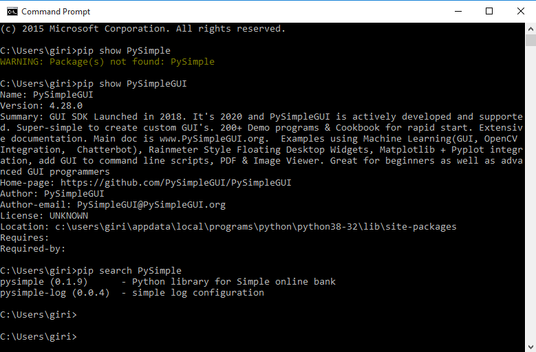

## ***Python_package_installation_over_cmd***
   **Program motive :-** Installing the required packages automatically via command prompt 
  
   **Pre-requisite things :**
   - Prerequisite file is package_files from another PC who has installed python on his/her system & with some extra packages/modules .
to get the all lists of packages list into a text file , just type " pip freeze > 'file_name.txt' " on your cmd/terminal.

   **Program Description :** 
   - Importing OS module , to run cmd with each package_name which is stored in a <python_packages.txt> file, os.system(command) #which results into a cmd with command
  
   **Useful commands of pip:**
    pip is a package manager for Python packages. When we install pip, it is added to the system as a command line program which can be run from the command line. We not only use pip to install and uninstall Python packages, it is rather a great tool to create Python virtual environment.
    
    - pip search <package_name>
            The above command useful to search a details/content about particular package which is installed on our machine. 
            
    - pip install <package_name>
            The above command useful to install new package onto our machine.
                     
    - pip install --no-cache-dir <package_name> 
            The above command will do the installation from the python package server , not from cache storage which is present on our machine.
         
    - pip show <package_name>
            The above command is usefull when we wanted to know the full info about a specific installed package.
            
    - pip uninstall <package_name>
            The above command useful to uninstall the installed package from our machine.
           
    - pip list
            The above command will list out all installed packages which is present at our machine.
            
    - pip freeze 
            The above command is also does the similar action as pip list does.
           
    - pip install -r <path_to_file>
            The above command will do the installation of each package & version from the file which user will specifies <path_to_file>.
            
    - pip install <package_name>==<version_number>
            The above command will install specific version of package name.
            Ex : pip install spyder==4.2.0
     
   **   
