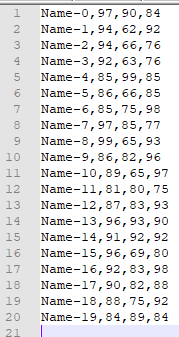
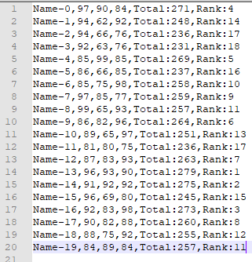

# student_ranking_series

the first python file is 'input_file_creation.py' will creates a student database by getting all required information fro user , if user doesnot know the name of a student & his/her subjects , then it will consider the defaults names into a 'student_database.txt' file.

so after execution of 'input_file_creation.py' will get 'student_database.txt' file in this way:

Student_name-[series],subject_name-[marks],subject_name-[marks],subject_name-[marks]
  
  
then we will use the above 'student_database.txt' file to create 'student_database_ranking.txt' file by using 'output_file_creation.py' file.

so after execution of 'output_file_creation.py' will get 'student_database_ranking.txt' file in this way:

Student_name-[series],subject_name-[marks],subject_name-[marks],subject_name-[marks],Total_marks-[total_score],Rank-[rankseries]

**One more assumption that user have one input.txt file which contains students name , and his/her marks of 3 subjects , program has to find out his/her total marks & his/her rank series among all the other students.**

Things:
* main program is :- rank_series_calculation.py
* input file is :- input.txt
* output file is :-  output.txt

input.txt file looks like below :

 

output.txt file should looks like below:

